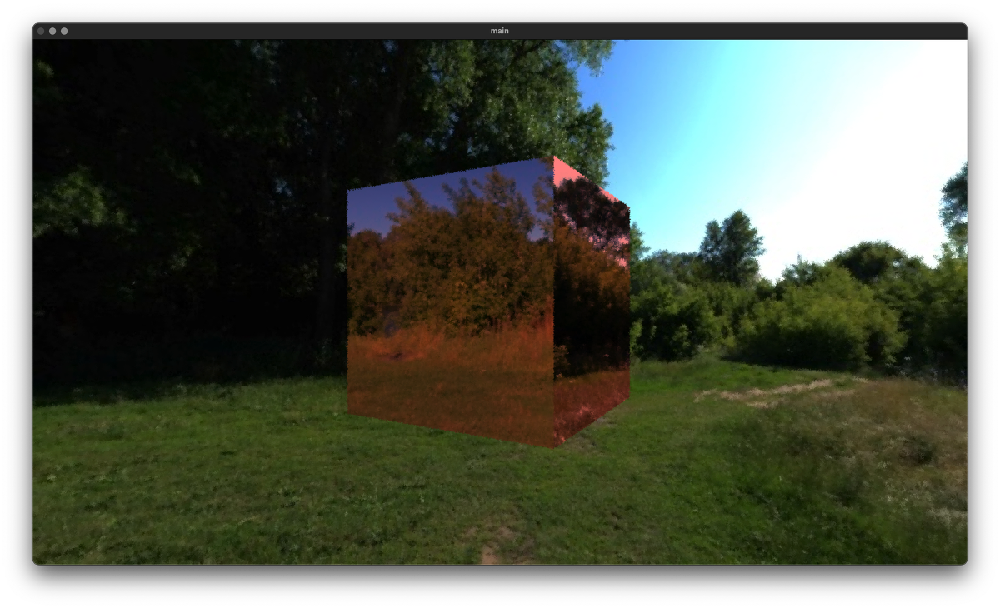

# p3d-ray.py

## 日本語

`p3d-ray.py` は、Processing ライクな書き方で 3D 空間を記述し、レイトレーシングで描画するための Python ライブラリです。フルスクラッチ実装で、ビジュアルプログラミングのように関数を積み重ねて scene を作り、その結果をレイトレーシングします。

参考: https://www.honma.site/ja/works/P3DRay/

### 特徴

- `translate`、`rotateY`、`box` などの Processing 風 API
- `set_material` によるマテリアル指定
- `set_world_color` / `set_environment_texture` による背景指定
- `camera` による画角・アスペクト比・解像度指定
- AABB と triangle intersection を使ったレイトレーシング
- OpenCV window への描画

### 必要環境

- Python 3
- NumPy
- OpenCV (`cv2`)
- Pillow

```bash
pip install numpy opencv-python pillow
```

### 最小サンプル

`main.py` には次のような最小サンプルが入っています。環境テクスチャを背景に設定し、ピンク色の金属的な box を配置して render します。

```python
from p3dray import *

set_environment_texture("meadow_2_2k.jpg")

rotateY(radians(30))
translate(0, 0, 5)

set_material(base_color=[1, 0.8, 0.8], metalic=1, roughness=1)
box(2.2, 2.2, 2.2)

render(sample_N=5)
```

出力例:



この例のマテリアル設定:

```python
set_material(base_color=[1, 0.8, 0.8], metalic=1, roughness=0)
```

実行:

```bash
python main.py
```

### 背景色とカメラを指定する例

```python
from p3dray import *

camera(theta=radians(70), aspect=9 / 16, resolution=(800, 450))
set_world_color([0.05, 0.08, 0.12])

translate(0, 0, 6)
set_material(base_color=[0.2, 0.7, 1.0], metalic=0.2, roughness=0.4)
box(2, 2, 2)

render(sample_N=3)
```

`render()` は OpenCV の window を開いて描画します。GUI が使えない環境では表示できない点に注意してください。

### 複数オブジェクトを置く例

座標変換は内部の行列に積み上がります。`translate` や `rotateY` を呼んだあとに `box` を作ると、その時点の変換が geometry に反映されます。

```python
from p3dray import *

set_environment_texture("meadow_2_2k.jpg")
camera(theta=radians(80), aspect=9 / 16, resolution=(960, 540))

set_material(base_color=[1.0, 0.3, 0.25], metalic=0.0, roughness=0.8)
translate(-1.5, 0, 6)
box(1.2, 1.2, 1.2)

set_material(base_color=[0.8, 0.8, 1.0], metalic=1.0, roughness=0.2)
translate(3.0, 0, 0)
rotateY(radians(35))
box(1.2, 1.2, 1.2)

render(sample_N=8)
```

### 公開 API

| API | 役割 |
| --- | --- |
| `box(x, y, z)` | 現在の変換行列と material で直方体を scene に追加 |
| `translate(x, y, z)` | 以降に作る object の位置を移動 |
| `rotateX(theta)` / `rotateY(theta)` / `rotateZ(theta)` | 以降に作る object を回転 |
| `radians(deg)` | degree を radian に変換 |
| `set_material(...)` | base color、metallic、roughness、transmission、IOR を指定 |
| `set_world_color(color)` | 単色背景を指定 |
| `set_environment_texture(path)` | 全天球風の環境テクスチャを背景に指定 |
| `camera(theta, aspect, resolution)` | 画角、アスペクト比、解像度を指定 |
| `render(sample_N=1)` | scene をレイトレーシングして OpenCV window に表示 |

### 構成

- `p3dray/renderer`: render entry point
- `p3dray/raytracer`: ray tracing と ray casting
- `p3dray/primitive`: `box` などの primitive
- `p3dray/material`: material と texture
- `p3dray/world`: world color / environment texture
- `p3dray/camera`: camera ray の生成
- `p3dray/coordinate`: 変換行列
- `p3dray/geometry`: vertex、surface、object
- `main.py`: サンプル
- `play.py`: 実験用スクリプト
- `*.jpg`, `*.png`, `*.exr`: サンプルアセット

### 注意

現状の primitive は主に `box` です。画像出力はファイル保存ではなく OpenCV window 表示です。研究・授業課題由来の実験実装なので、汎用 3D ライブラリというより、レイトレーシングの仕組みを試すための小さな環境として扱ってください。

## English

`p3d-ray.py` is a Python ray-tracing experiment that lets users describe 3D scenes with Processing-like APIs. It was built from scratch as a computer graphics assignment and focuses on making ray tracing programmable through a compact API.

Reference: https://www.honma.site/ja/works/P3DRay/

### Features

- Processing-like APIs such as `translate`, `rotateY`, and `box`
- Material setup with `set_material`
- World color and environment texture support
- Camera field-of-view, aspect ratio, and resolution setup
- Ray tracing with AABB and triangle intersection
- Rendering to an OpenCV window

### Requirements

- Python 3
- NumPy
- OpenCV (`cv2`)
- Pillow

```bash
pip install numpy opencv-python pillow
```

### Minimal Example

```python
from p3dray import *

set_environment_texture("meadow_2_2k.jpg")

rotateY(radians(30))
translate(0, 0, 5)

set_material(base_color=[1, 0.8, 0.8], metalic=1, roughness=1)
box(2.2, 2.2, 2.2)

render(sample_N=5)
```

Example output:


Material used in this example:

```python
set_material(base_color=[1, 0.8, 0.8], metalic=1, roughness=0)
```

Run:

```bash
python main.py
```

### Camera and World Color Example

```python
from p3dray import *

camera(theta=radians(70), aspect=9 / 16, resolution=(800, 450))
set_world_color([0.05, 0.08, 0.12])

translate(0, 0, 6)
set_material(base_color=[0.2, 0.7, 1.0], metalic=0.2, roughness=0.4)
box(2, 2, 2)

render(sample_N=3)
```

`render()` opens an OpenCV window, so it requires a GUI-capable environment.

### Multiple Boxes Example

```python
from p3dray import *

set_environment_texture("meadow_2_2k.jpg")
camera(theta=radians(80), aspect=9 / 16, resolution=(960, 540))

set_material(base_color=[1.0, 0.3, 0.25], metalic=0.0, roughness=0.8)
translate(-1.5, 0, 6)
box(1.2, 1.2, 1.2)

set_material(base_color=[0.8, 0.8, 1.0], metalic=1.0, roughness=0.2)
translate(3.0, 0, 0)
rotateY(radians(35))
box(1.2, 1.2, 1.2)

render(sample_N=8)
```

### Public API

| API | Role |
| --- | --- |
| `box(x, y, z)` | add a box to the scene |
| `translate(x, y, z)` | move subsequent objects |
| `rotateX(theta)` / `rotateY(theta)` / `rotateZ(theta)` | rotate subsequent objects |
| `radians(deg)` | convert degrees to radians |
| `set_material(...)` | set base color, metallic, roughness, transmission, and IOR |
| `set_world_color(color)` | set a solid world background |
| `set_environment_texture(path)` | set an environment texture |
| `camera(theta, aspect, resolution)` | configure the camera |
| `render(sample_N=1)` | trace and display the scene |

### Notes

The current public primitive is mainly `box`. Rendering displays an OpenCV window instead of saving an image file. Treat this as a compact educational ray-tracing environment rather than a general-purpose 3D engine.
